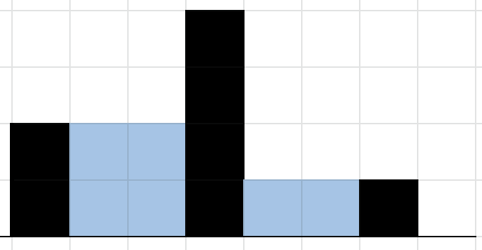

# Rain

## 🔖 Table of contents

<details>
        <summary>
        CLICK TO ENLARGE 😇
        </summary>
        📄 <a href="#description">Description</a>
        <br>
        🎓 <a href="#objectives">Objectives</a>
        <br>
        📋 <a href="#requirements">Requirements</a>
        <br>
        📝 <a href="#instructions">Instructions</a>
        <br>
        🔨 <a href="#tech-stack">Tech stack</a>
        <br>
        📂 <a href="#files-description">Files description</a>
        <br>
        💻 <a href="#installation_and_how_to_use">Installation and how to use</a>
        <br>
        ♥️ <a href="#thanks">Thanks</a>
        <br>
        👷 <a href="#authors">Authors</a>
</details>

## 📄 <span id="description">Description</span>

This project focuses on calculating how many square units of water can be retained between walls of varying heights. Imagine looking at a cross-section of walls after it has rained; the goal is to determine how much water would be *trapped* between these walls.

You are given a list of non-negative integers representing the heights of walls with unit width 1. You need to compute the total amount of rainwater retained, assuming that:

- Water cannot be held beyond the leftmost or rightmost wall (the *edges* are open).
- The list might be empty, in which case the amount of retained water is zero.

This challenge is known as the **Trapping Rain Water** problem.

## 🎓 <span id="objectives">Objectives</span>

At the end of this project, I had to be able to explain to anyone, **without the help of Google** :

- How to identify the regions where water can accumulate between walls of varying heights.
- Different approaches to solve this problem (e.g., brute force vs. two-pointer).
- How to implement the solution in Python without importing external modules.
- Why handling the edges is essential, and how to handle them properly.
- How to consider time and space complexity for an optimal solution.

## 📋 <span id="requirements">Requirements</span>

- All my files should end with a new line.
- The first line of all my files should be exactly `#!/usr/bin/python3`.
- A `README.md` file, at the root of the folder of the project, is mandatory.
- My code should be documented.
- My code should use the `PEP 8` style (version 1.7.x).
- All my files must be executable.

## 📝 <span id="instructions">Instructions</span>

<details>
    <summary>
        <b>0. Lockboxes</b>
    </summary>
    <br>

Given a list of non-negative integers representing the heights of walls with unit width 1, as if viewing the cross-section of a relief map, calculate how many square units of water will be retained after it rains.

- Prototype: `def rain(walls)`.
- `walls` is a list of non-negative integers.
- Return: integer indicating total amount of rainwater retained.
- Assume that the ends of the list (before index 0 and after index walls[-1]) are **not** walls, meaning they will not retain water.
- If the list is empty return `0`.

```
jesse@ubuntu:~/$ cat 0_main.py
#!/usr/bin/python3
"""
0_main
"""
rain = __import__('0-rain').rain

if __name__ == "__main__":
    walls = [0, 1, 0, 2, 0, 3, 0, 4]
    print(rain(walls))
    walls = [2, 0, 0, 4, 0, 0, 1, 0]
    print(rain(walls))

jesse@ubuntu:~/$ 
jesse@ubuntu:~/$ ./0_main.py
6
6
jesse@ubuntu:~/$ 
```

Visual representation of the walls `[0, 1, 0, 2, 0, 3, 0, 4]`:

<p align="left">
    
</p>

Visual representation of the walls `[2, 0, 0, 4, 0, 0, 1, 0]`:

<p align="left">
    
</p>

#
**Repo:**
- GitHub repository: `holbertonschool-interview`.
- Directory: `rain`.
- File: `0-rain.py`.
<hr>
</details>

## 🔨 <span id="tech-stack">Tech stack</span>

<p align="left">
    
</p>

## 📂 <span id="files-description">File description</span>

| **FILE**    | **DESCRIPTION**                                                                    |
| :---------: | ---------------------------------------------------------------------------------- |
| `0-rain.py` | Python script that calculates the total amount of rainwater retained by the walls. |
| `0-main.py` | Sample main program to test the `rain` function with different inputs.             |
| `README.md` | The readme file you are currently reading 😉.                                      |

## 💻 <span id="installation_and_how_to_use">Installation and how to use</span>

**Installation:**

1. Clone this repository:
    - Open your preferred Terminal.
    - Navigate to the directory where you want to clone the repository.
    - Run the following command:

```
git clone https://github.com/fchavonet/holbertonschool-interview.git
```

2. Open the repository you've just cloned.

3. Navigate to the `rain` directory:

```
cd rain
```

4. Ensure the files are executable:

```
chmod 777 0-rain.py 0-main.py
```

**How to use:**

1. To test the function, run the `0-main.py` file with the following command:

```
./0-main.py
```

2. You can modify the `0-main.py` script with your own test cases if you want.

## ♥️ <span id="thanks">Thanks</span>

A big thank you to all my Holberton School peers for their help and support throughout these projects.

## 👷 <span id="authors">Authors</span>

**Fabien CHAVONET**
- Github: [@fchavonet](https://github.com/fchavonet)
